# NutriLens Design Document

**Project:** NutriLens  
**Course:** CSE 4104 — Software Development III  
**Team:** CSE4104-7A-T03  
**Prepared from:** UI/UX Design and Development Planning document  

---

## 1. Product Vision

NutriLens is an AI-powered nutrition analysis web application. Its main purpose is to help users understand the nutritional value and health impact of food by uploading a food image. Instead of manually searching for food items and entering calories, users can take or upload a meal photo and receive instant nutrition insights.

The product focuses on three major user needs:

1. Fast food recognition from an image.
2. Clear calorie and macro-nutrient analysis.
3. Health warnings and personalized dietary recommendations.

---

## 2. Design Goals

| Goal | Design Meaning |
|---|---|
| Simple | Users should be able to upload food images without confusion |
| Mobile-first | The interface should work smoothly on mobile screens |
| Visual | Nutrition data should be shown with cards, charts, and icons |
| Trustworthy | Result pages should clearly show detected food, calories, macros, and warnings |
| Personalized | Profile data should improve recommendations and risk alerts |
| Fast | The user should receive results quickly after uploading an image |

---

## 3. Original UI Screens from Document

The following screens were extracted from the submitted UI/UX document and included here as design references.

### 3.1 Home Page

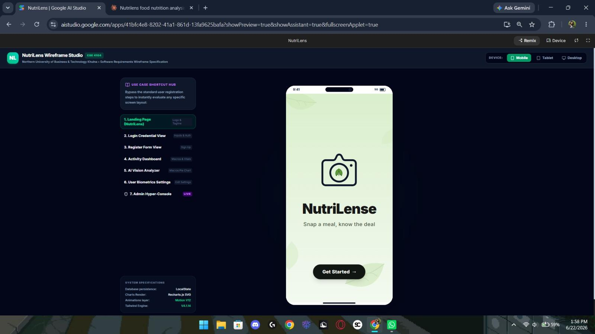

### 3.2 Login Page

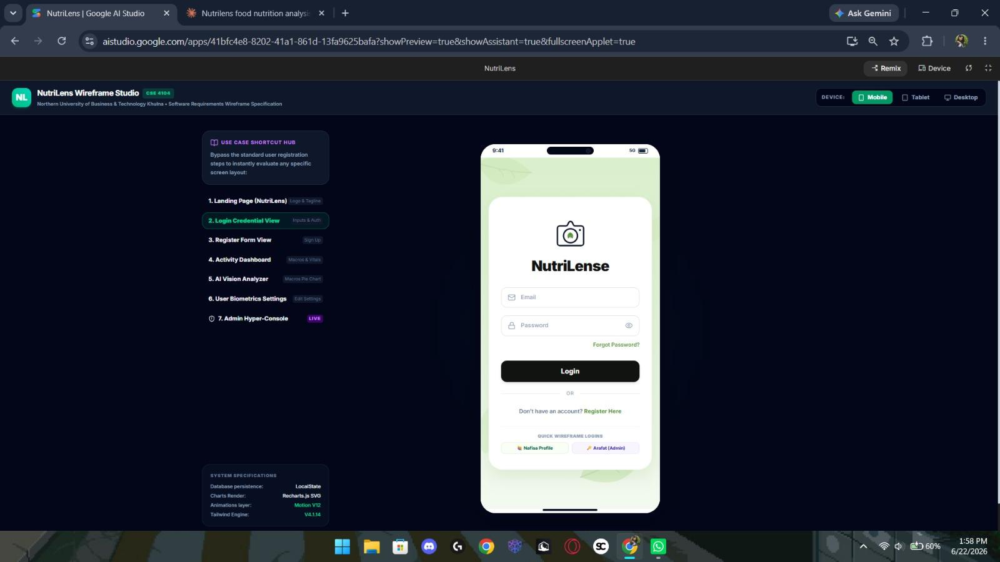

### 3.3 Dashboard

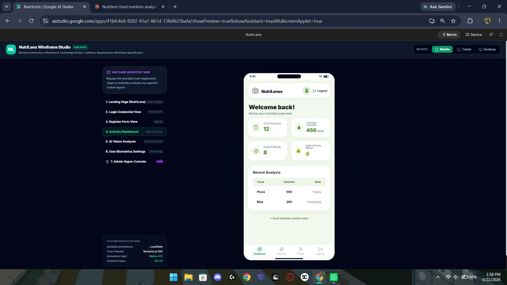

### 3.4 AI Lens Upload Page

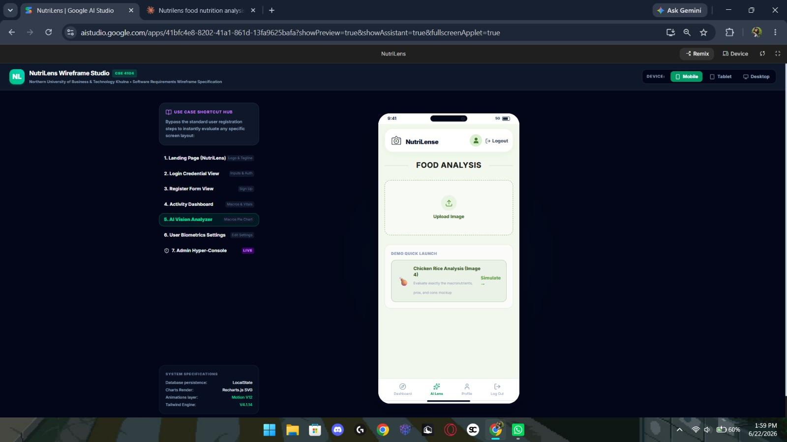

### 3.5 Food Result Summary Page

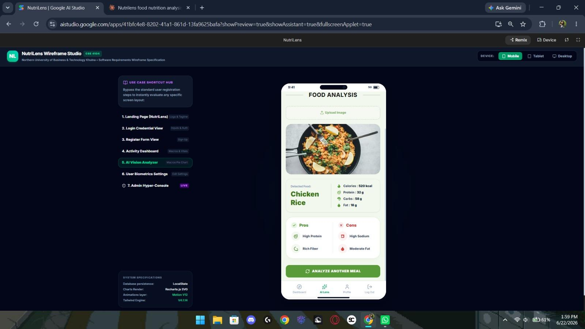

### 3.6 Result Chart and Warning Page

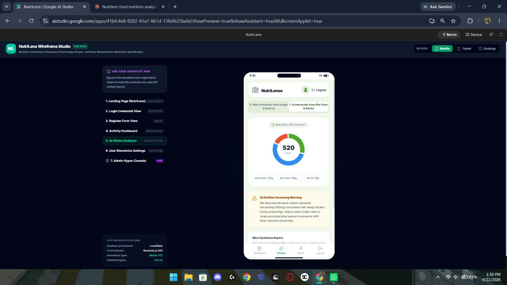

### 3.7 Result Detail and Recommendation Page

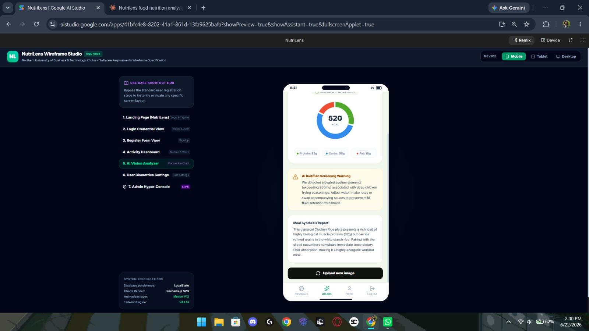

### 3.8 Profile Page

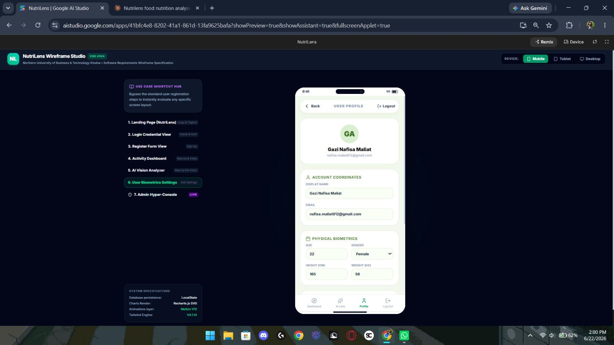

---

## 4. Information Architecture

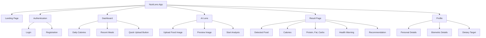

---

## 5. User Flow Graph

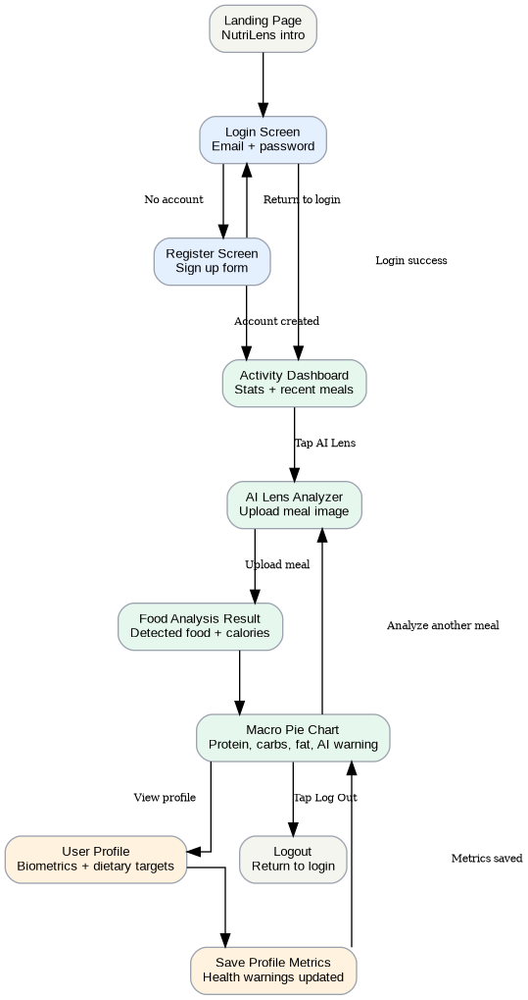

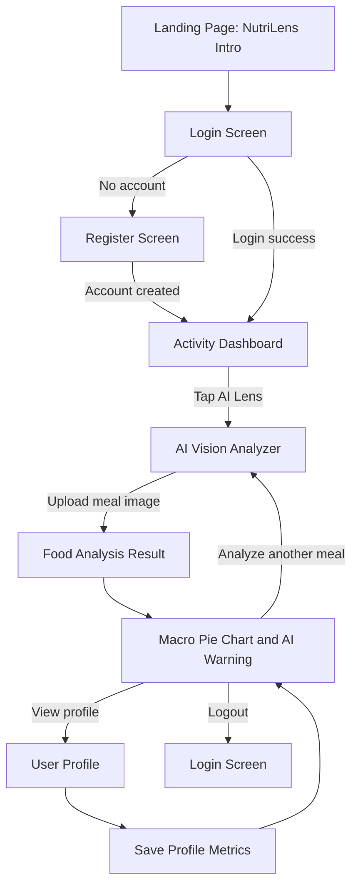

---

## 6. Original User Flow Diagram

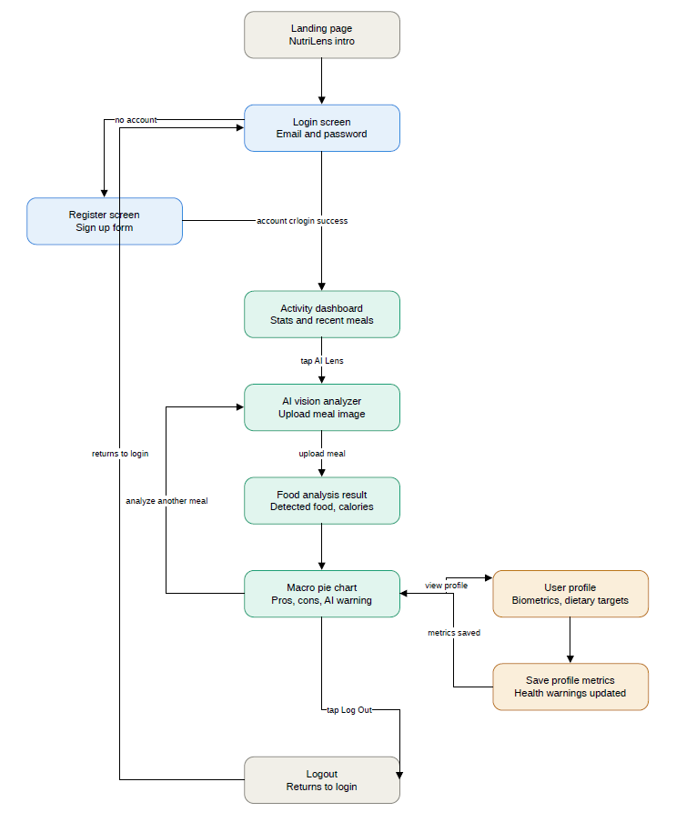

---

## 7. System Architecture Design

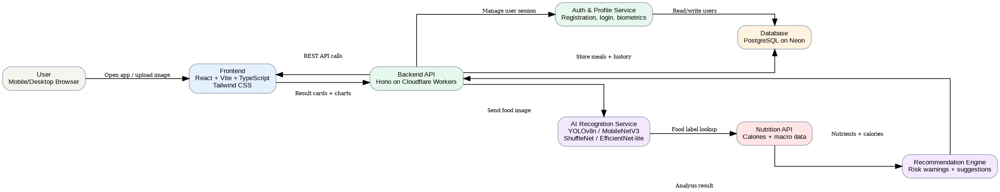

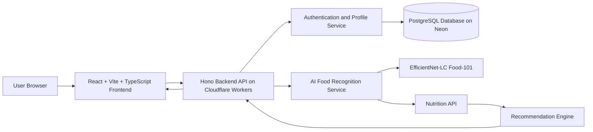

---

## 8. AI and Nutrition Analysis Pipeline

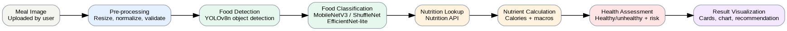

```mermaid
flowchart LR
    A[Uploaded Meal Image] --> B[Image Pre-processing]
    B --> C[Food Detection]
    C --> D[Food Classification]
    D --> E[Nutrition API Lookup]
    E --> F[Calories and Macro Calculation]
    F --> G[Healthy or Unhealthy Classification]
    G --> H[Risk Warning]
    H --> I[Personalized Recommendation]
    I --> J[Result Page Visualization]
```

---

## 9. Data Model Design

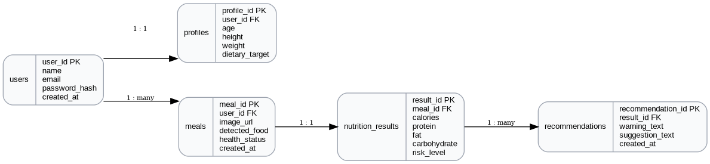

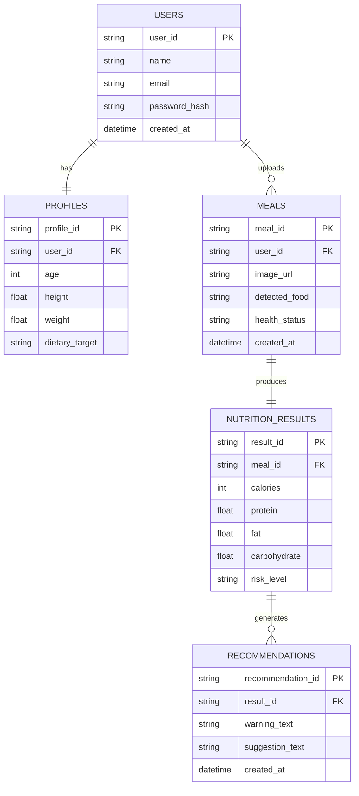

---

## 10. Visual Design System

### 10.1 Color Palette

| Token | Color | Usage |
|---|---|---|
| Primary Green | `#69B34C` | Main action buttons, success, healthy status |
| Light Green | `#EAF8E4` | App background, soft card backgrounds |
| Dark Text | `#111827` | Headings and high-contrast text |
| Medium Text | `#4B5563` | Body text and secondary labels |
| Warning Amber | `#F59E0B` | Caution and moderate health warning |
| Error Red | `#EF4444` | Risk alerts and unhealthy status |
| White | `#FFFFFF` | Cards and phone screen surface |
| Dark Navy | `#020617` | Presentation background and dark theme preview |

### 10.2 Typography

| Element | Suggested Style |
|---|---|
| App title | 24–28px, bold |
| Screen title | 18–22px, semi-bold |
| Card title | 14–16px, semi-bold |
| Body text | 13–15px, regular |
| Caption text | 11–12px, medium |

### 10.3 Component Style

| Component | Style Direction |
|---|---|
| Primary Button | Rounded rectangle, green background, white text |
| Secondary Button | White background, thin border, dark text |
| Nutrition Card | Rounded card, soft shadow, icon + numeric value |
| Warning Card | Light amber/red background depending on risk |
| Upload Box | Large rounded drop zone with camera/upload icon |
| Bottom Navigation | Four tabs: Home, AI Lens, Results, Profile |

---

## 11. Screen-by-Screen Design Specification

### 11.1 Landing Page

**Purpose:** Introduce NutriLens and guide users to start using the application.

**Main elements:**

- NutriLens logo or camera icon
- Short tagline: “Snap a meal, know the deal”
- Get Started button
- Clean mobile phone-style layout

### 11.2 Login Page

**Purpose:** Allow existing users to access their nutrition dashboard.

**Main elements:**

- Email input field
- Password input field
- Login button
- Registration link
- Optional social login buttons

### 11.3 Dashboard

**Purpose:** Provide a quick overview of the user’s nutrition activity.

**Main elements:**

- Welcome message
- Total calories card
- Protein, fat, and carbohydrate cards
- Recent analysis section
- Bottom navigation

### 11.4 AI Lens Upload Page

**Purpose:** Allow users to upload or capture a food image for AI analysis.

**Main elements:**

- Food analyzer title
- Upload box or camera button
- Image preview area
- Analyze button
- Loading state while the model processes the image

### 11.5 Result Page

**Purpose:** Show detected food and nutritional information.

**Main elements:**

- Uploaded food image
- Detected food name
- Calories
- Protein, fat, and carbohydrate values
- Healthy/unhealthy status
- Button to view detailed analysis

### 11.6 Result Chart Page

**Purpose:** Visualize nutrition information in a more understandable way.

**Main elements:**

- Macro pie chart
- Calories display
- AI warning card
- Recommendation text
- Continue or analyze another meal button

### 11.7 Profile Page

**Purpose:** Collect and manage user health-related details for personalization.

**Main elements:**

- User name and email
- Age, height, weight
- Dietary target
- Save profile metrics button
- Health warning update status

---

## 12. Wireframe Sketches

### 12.1 Mobile Home Wireframe

```text
+--------------------------------+
|            NutriLens           |
|                                |
|             [Camera]           |
|                                |
|      Snap a meal, know the deal|
|                                |
|          [ Get Started ]       |
+--------------------------------+
```

### 12.2 AI Lens Upload Wireframe

```text
+--------------------------------+
| < Back              Profile    |
|                                |
|          FOOD ANALYZER         |
|                                |
|      +------------------+      |
|      |     Upload       |      |
|      |   Food Image     |      |
|      +------------------+      |
|                                |
|        [ Analyze Meal ]        |
|                                |
| Home | AI Lens | Result | User |
+--------------------------------+
```

### 12.3 Result Page Wireframe

```text
+--------------------------------+
|          FOOD ANALYSIS         |
|                                |
|        [ Uploaded Image ]      |
|                                |
| Food: Chicken Rice             |
| Calories: 420 kcal             |
| Protein: 25g                   |
| Fat: 12g                       |
| Carbs: 52g                     |
|                                |
| Status: Healthy                |
| [ View Macro Chart ]           |
+--------------------------------+
```

---

## 13. Frontend Route Design

```mermaid
flowchart TD
    A[/] --> B[/login]
    A --> C[/register]
    B --> D[/dashboard]
    C --> D
    D --> E[/ai-lens]
    E --> F[/analysis-result/:mealId]
    F --> G[/analysis-chart/:mealId]
    D --> H[/profile]
    H --> D
```

| Route | Page | Access |
|---|---|---|
| `/` | Landing page | Public |
| `/login` | Login page | Public |
| `/register` | Registration page | Public |
| `/dashboard` | Dashboard | Authenticated user |
| `/ai-lens` | Food image upload | Authenticated user |
| `/analysis-result/:mealId` | Food analysis result | Authenticated user |
| `/analysis-chart/:mealId` | Macro chart and recommendation | Authenticated user |
| `/profile` | User profile | Authenticated user |

---

## 14. Backend API Design

| Method | Endpoint | Purpose |
|---|---|---|
| `POST` | `/api/auth/register` | Create new user account |
| `POST` | `/api/auth/login` | Authenticate user |
| `GET` | `/api/profile` | Fetch profile details |
| `PUT` | `/api/profile` | Update profile metrics |
| `POST` | `/api/meal/upload` | Upload food image |
| `POST` | `/api/meal/analyze` | Run AI food recognition |
| `GET` | `/api/meal/:id/result` | Fetch analysis result |
| `GET` | `/api/meal/history` | Fetch recent meal history |
| `GET` | `/api/recommendation/:mealId` | Fetch health warning and recommendation |

---

## 15. UI State Design

| State | User Experience |
|---|---|
| Empty state | Show friendly message: “Upload your first meal to begin.” |
| Loading state | Show spinner and text: “Analyzing your food image...” |
| Success state | Show detected food, calories, macros, and recommendation |
| Error state | Show message: “Could not detect food clearly. Please upload another image.” |
| Offline/API failure | Show retry button and keep previous data visible if available |

---

## 16. Responsive Design Rules

| Device | Design Behavior |
|---|---|
| Mobile | Single-column layout, bottom navigation, large upload button |
| Tablet | Centered mobile card layout with larger margins |
| Desktop | Mobile preview or dashboard-style layout with side panel |

---

## 17. Accessibility Design

- Use high contrast between text and background.
- Give each input field a visible label.
- Use alt text for uploaded image previews.
- Do not use color alone to indicate risk; include text labels such as “Healthy,” “Moderate Risk,” and “High Risk.”
- Buttons should be large enough for mobile touch interaction.
- Error messages should be clear and placed near the affected field.

---

## 18. Final Technology Stack

| Area | Technology |
|---|---|
| Frontend | React, Vite, TypeScript, Tailwind CSS |
| Backend | Hono on Cloudflare Workers |
| Database | PostgreSQL on Neon |
| AI / Machine Learning | Gemini vision API |
| API and Tools | Nutrition API for food data analysis |

---

## 19. Design Acceptance Checklist

- [ ] Landing page is simple and clear
- [ ] Login and registration pages work correctly
- [ ] Dashboard shows user nutrition summary
- [ ] AI Lens upload interface is easy to use
- [ ] Result page shows food image, detected food, calories, and macros
- [ ] Macro chart page includes health warning and recommendation
- [ ] Profile page stores user biometrics and dietary target
- [ ] Application is responsive on mobile and desktop
- [ ] Error, loading, and empty states are designed
- [ ] UI is consistent with the NutriLens color palette
- [ ] Architecture and data model are documented
- [ ] User flow and system graphs are included
