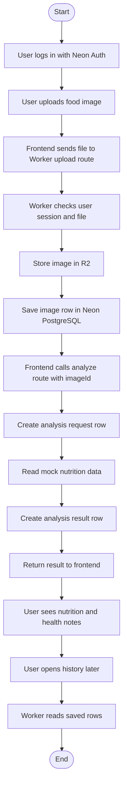

# Activity Diagram

## Major feature: Upload food image and get result

```mermaid
flowchart TD
    A([Start]) --> B[User logs in with Neon Auth]
    B --> C[User uploads food image]
    C --> D[Frontend sends file to Worker upload route]
    D --> E[Worker checks user session and file]
    E --> F[Store image in R2]
    F --> G[Save image row in Neon PostgreSQL]
    G --> H[Frontend calls analyze route with imageId]
    H --> I[Create analysis request row]
    I --> J[Read mock nutrition data]
    J --> K[Create analysis result row]
    K --> L[Return result to frontend]
    L --> M[User sees nutrition and health notes]
    M --> N[User opens history later]
    N --> O[Worker reads saved rows]
    O --> P([End])
```
