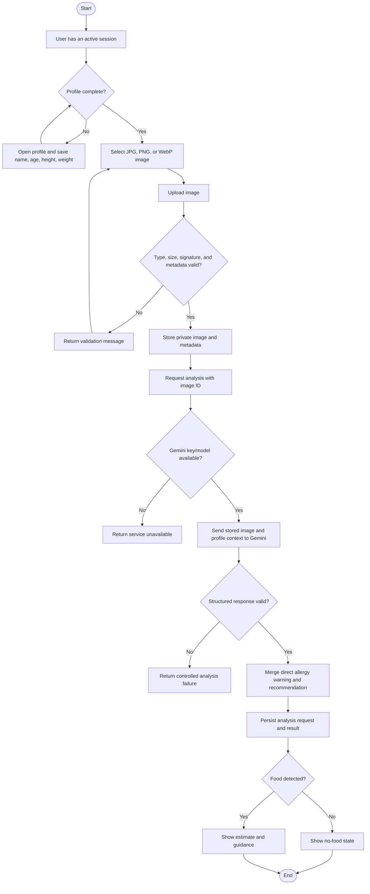

# Food Scan Activity Diagram

```mermaid
flowchart TD
    A([Start]) --> B[User has an active session]
    B --> C{Profile complete?}
    C -- No --> D[Open profile and save name, age, height, weight]
    D --> C
    C -- Yes --> E[Select JPG, PNG, or WebP image]
    E --> F[Upload image]
    F --> G{Type, size, signature, and metadata valid?}
    G -- No --> H[Return validation message]
    H --> E
    G -- Yes --> I[Store private image and metadata]
    I --> J[Request analysis with image ID]
    J --> K{Gemini key/model available?}
    K -- No --> L[Return service unavailable]
    K -- Yes --> M[Send stored image and profile context to Gemini]
    M --> N{Structured response valid?}
    N -- No --> O[Return controlled analysis failure]
    N -- Yes --> P[Merge direct allergy warning and recommendation]
    P --> Q[Persist analysis request and result]
    Q --> R{Food detected?}
    R -- No --> S[Show no-food state]
    R -- Yes --> T[Show estimate and guidance]
    S --> U([End])
    T --> U
```
