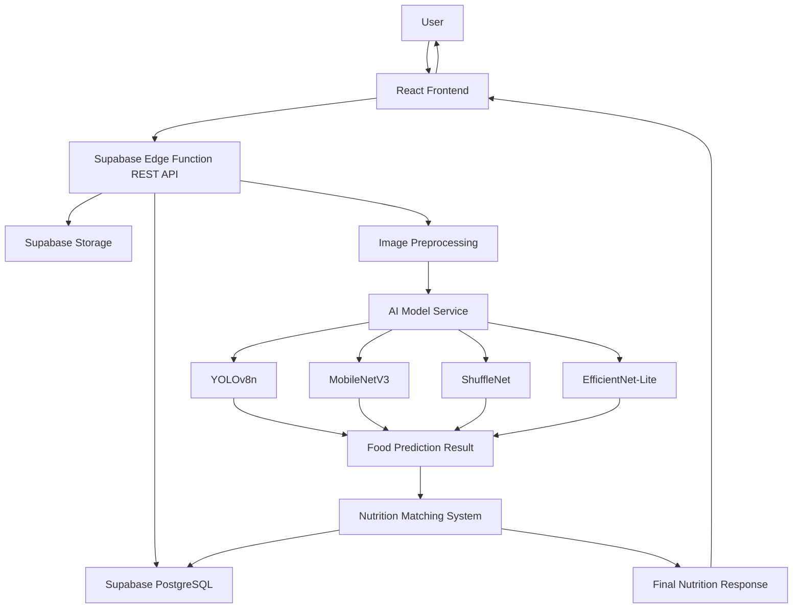
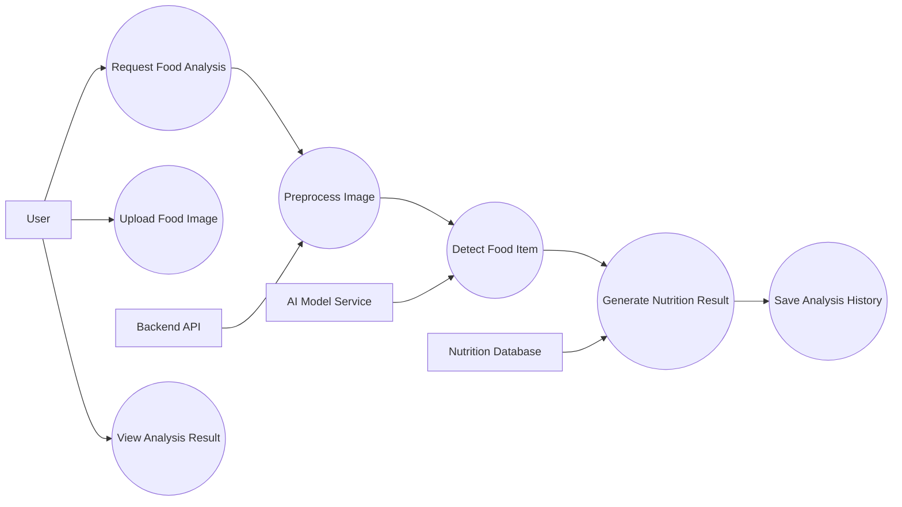
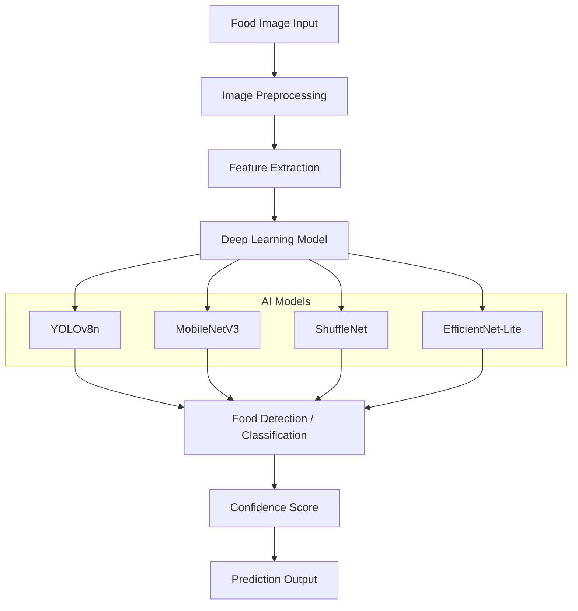
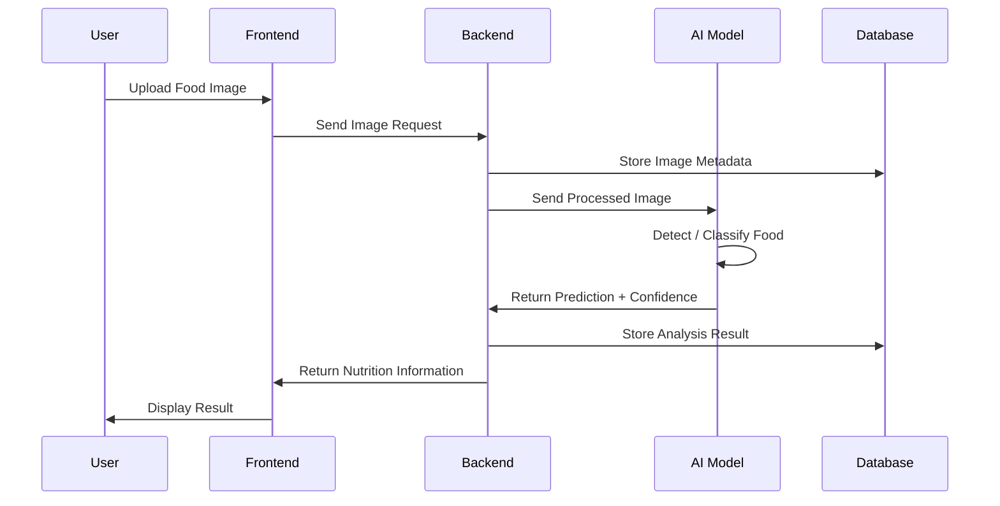

# AI Integration Workflow Diagram

```mermaid
flowchart TD
    U[User]
    F[React Frontend]
    API[Supabase Edge Function REST API]
    S[Supabase Storage]
    DB[Supabase PostgreSQL]
    P[Image Preprocessing]
    AI[AI Model Service]

    YOLO[YOLOv8n]
    MOB[MobileNetV3]
    SHUF[ShuffleNet]
    EFF[EfficientNet-Lite]

    R[Food Prediction Result]
    N[Nutrition Matching System]
    O[Final Nutrition Response]

    U --> F
    F --> API

    API --> S
    API --> DB

    API --> P
    P --> AI

    AI --> YOLO
    AI --> MOB
    AI --> SHUF
    AI --> EFF

    YOLO --> R
    MOB --> R
    SHUF --> R
    EFF --> R

    R --> N
    N --> DB
    N --> O

    O --> F
    F --> U
```

---

# AI Use Case Diagram

```mermaid
flowchart LR
    U[User]
    API[Backend API]
    AI[AI Model Service]
    DB[Nutrition Database]

    UC1((Upload Food Image))
    UC2((Request Food Analysis))
    UC3((Preprocess Image))
    UC4((Detect Food Item))
    UC5((Generate Nutrition Result))
    UC6((View Analysis Result))
    UC7((Save Analysis History))

    U --> UC1
    U --> UC2
    U --> UC6

    UC2 --> UC3
    UC3 --> UC4
    UC4 --> UC5

    API --> UC3
    AI --> UC4
    DB --> UC5

    UC5 --> UC7
```

---

# AI Model Architecture

```mermaid
flowchart TD
    I[Food Image Input]

    P[Image Preprocessing]

    FE[Feature Extraction]

    M[Deep Learning Model]

    D[Food Detection / Classification]

    C[Confidence Score]

    R[Prediction Output]

    I --> P
    P --> FE
    FE --> M
    D --> C
    C --> R


    subgraph AI Models
        Y[YOLOv8n]
        MV[MobileNetV3]
        SH[ShuffleNet]
        EL[EfficientNet-Lite]
    end

    M --> Y
    M --> MV
    M --> SH
    M --> EL

    Y --> D
    MV --> D
    SH --> D
    EL --> D

```

---

# AI Processing Flow

```mermaid
sequenceDiagram
    participant User
    participant Frontend
    participant Backend
    participant AI Model
    participant Database

    User->>Frontend: Upload Food Image
    Frontend->>Backend: Send Image Request

    Backend->>Database: Store Image Metadata
    Backend->>AI Model: Send Processed Image

    AI Model->>AI Model: Detect / Classify Food

    AI Model->>Backend: Return Prediction + Confidence

    Backend->>Database: Store Analysis Result

    Backend->>Frontend: Return Nutrition Information

    Frontend->>User: Display Result
```

