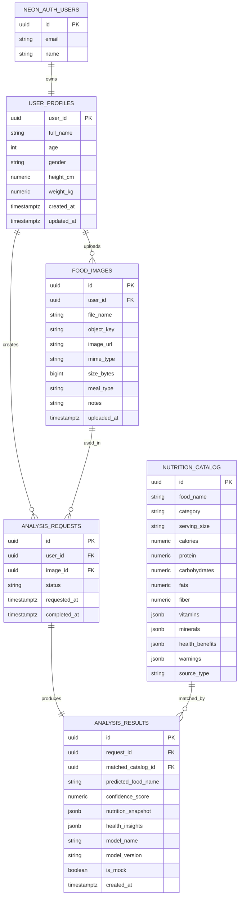

# ER Diagram

```mermaid
erDiagram
    NEON_AUTH_USERS ||--|| USER_PROFILES : owns
    USER_PROFILES ||--o{ FOOD_IMAGES : uploads
    USER_PROFILES ||--o{ ANALYSIS_REQUESTS : creates
    FOOD_IMAGES ||--o{ ANALYSIS_REQUESTS : used_in
    ANALYSIS_REQUESTS ||--|| ANALYSIS_RESULTS : produces
    NUTRITION_CATALOG ||--o{ ANALYSIS_RESULTS : matched_by

    NEON_AUTH_USERS {
        uuid id PK
        string email
        string name
    }

    USER_PROFILES {
        uuid user_id PK
        string full_name
        int age
        string gender
        numeric height_cm
        numeric weight_kg
        timestamptz created_at
        timestamptz updated_at
    }

    FOOD_IMAGES {
        uuid id PK
        uuid user_id FK
        string file_name
        string object_key
        string image_url
        string mime_type
        bigint size_bytes
        string meal_type
        string notes
        timestamptz uploaded_at
    }

    NUTRITION_CATALOG {
        uuid id PK
        string food_name
        string category
        string serving_size
        numeric calories
        numeric protein
        numeric carbohydrates
        numeric fats
        numeric fiber
        jsonb vitamins
        jsonb minerals
        jsonb health_benefits
        jsonb warnings
        string source_type
    }

    ANALYSIS_REQUESTS {
        uuid id PK
        uuid user_id FK
        uuid image_id FK
        string status
        timestamptz requested_at
        timestamptz completed_at
    }

    ANALYSIS_RESULTS {
        uuid id PK
        uuid request_id FK
        uuid matched_catalog_id FK
        string predicted_food_name
        numeric confidence_score
        jsonb nutrition_snapshot
        jsonb health_insights
        string model_name
        string model_version
        boolean is_mock
        timestamptz created_at
    }
```
