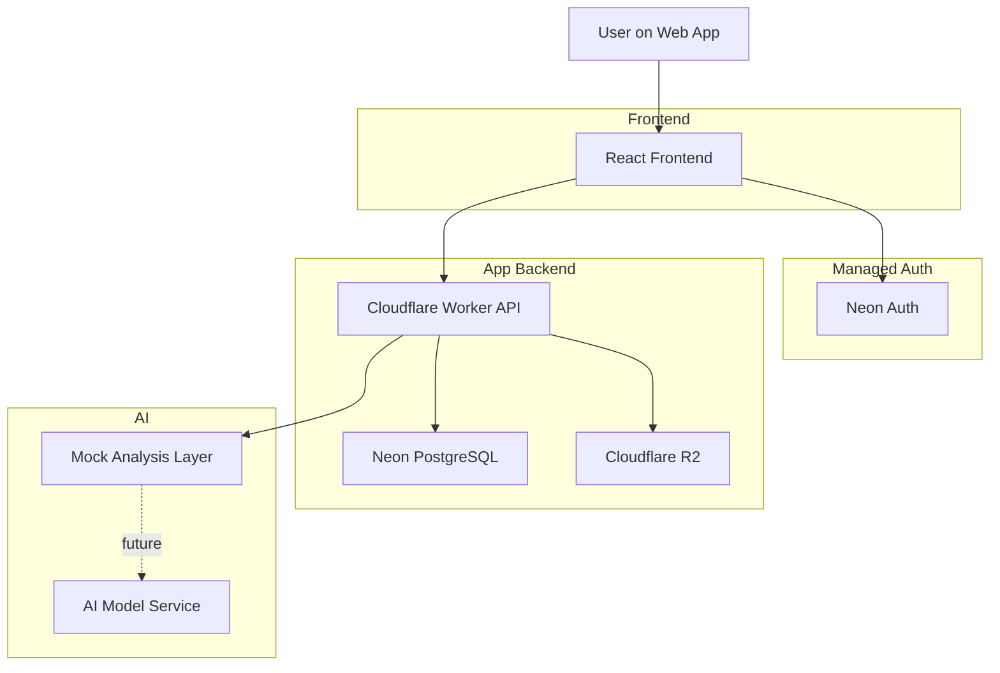

# System Architecture Diagram

## User flow

1. User signs up or logs in with Neon Auth
2. Frontend keeps session
3. User uploads food image
4. Worker stores file in R2 and metadata in Neon
5. Frontend asks for analysis using image id
6. Worker returns mock nutrition result now
7. Future version will call AI model before final response
