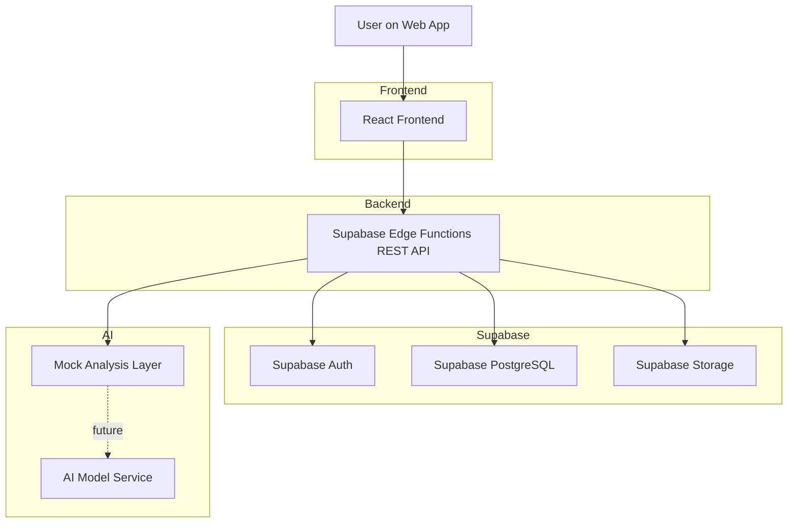

# System Architecture Diagram

## User flow

1. User signs up or logs in from frontend
2. Frontend calls Edge Function auth endpoints
3. User uploads food image
4. Edge Function stores file in Storage and metadata in database
5. Frontend asks for analysis using image id
6. Backend returns mock nutrition result now
7. Future version will call AI model before final response
