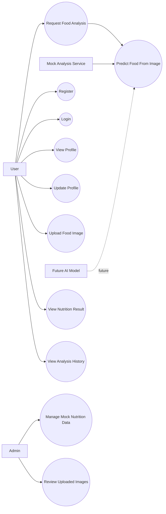

# Use Case Diagram

```mermaid
flowchart LR
    U[User]
    A[Admin]
    M[Mock Analysis Service]
    AI[Future AI Model]

    UC1((Register))
    UC2((Login))
    UC3((View Profile))
    UC4((Update Profile))
    UC5((Upload Food Image))
    UC6((Request Food Analysis))
    UC7((View Nutrition Result))
    UC8((View Analysis History))
    UC9((Manage Mock Nutrition Data))
    UC10((Review Uploaded Images))
    UC11((Predict Food From Image))

    U --> UC1
    U --> UC2
    U --> UC3
    U --> UC4
    U --> UC5
    U --> UC6
    U --> UC7
    U --> UC8

    A --> UC9
    A --> UC10

    UC6 --> UC11
    M --> UC11
    AI -. future .-> UC11
```
