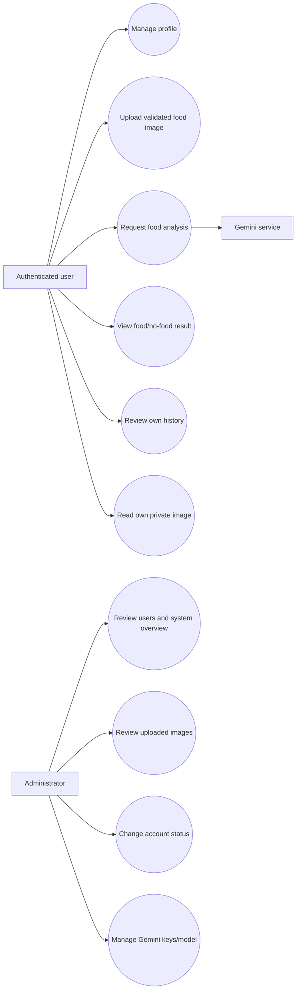

# Use Case Diagram

```mermaid
flowchart LR
    User[Authenticated user]
    Admin[Administrator]
    Gemini[Gemini service]

    Profile((Manage profile))
    Upload((Upload validated food image))
    Analyze((Request food analysis))
    Result((View food/no-food result))
    History((Review own history))
    Image((Read own private image))
    Overview((Review users and system overview))
    UploadReview((Review uploaded images))
    Accounts((Change account status))
    Settings((Manage Gemini keys/model))

    User --> Profile
    User --> Upload
    User --> Analyze
    User --> Result
    User --> History
    User --> Image

    Analyze --> Gemini

    Admin --> Overview
    Admin --> UploadReview
    Admin --> Accounts
    Admin --> Settings
```

All user image, history, and result operations are scoped to the active account. Administrative operations require the authenticated Neon role to be `admin`.
