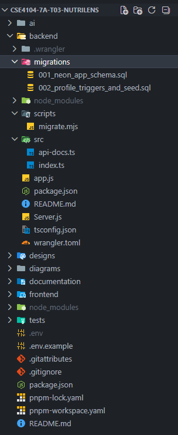
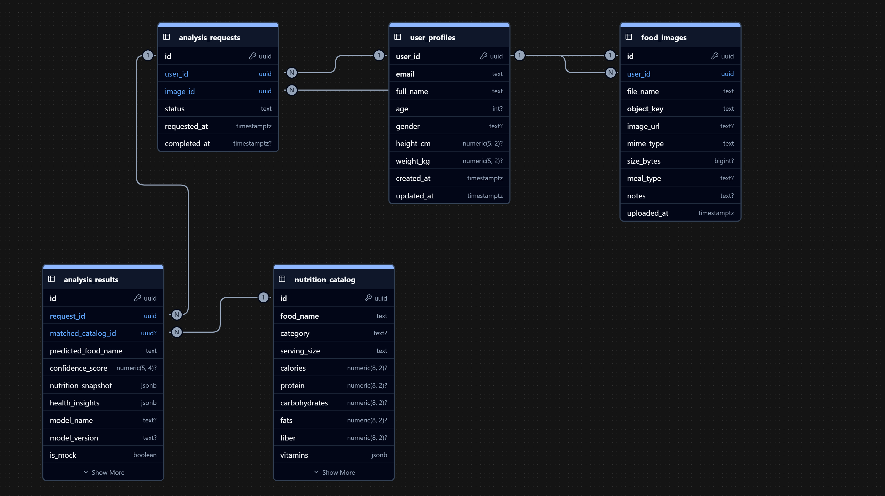
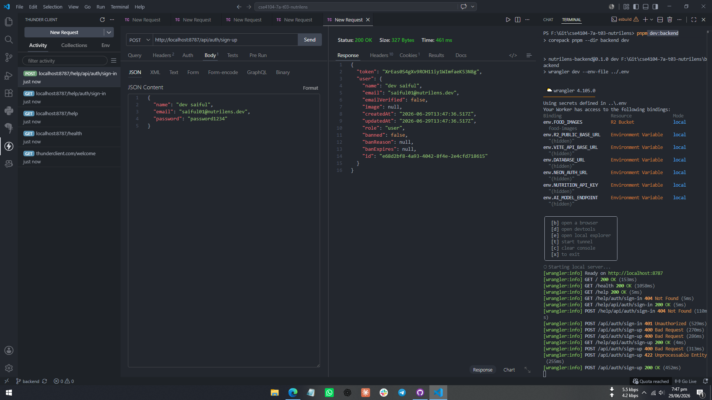
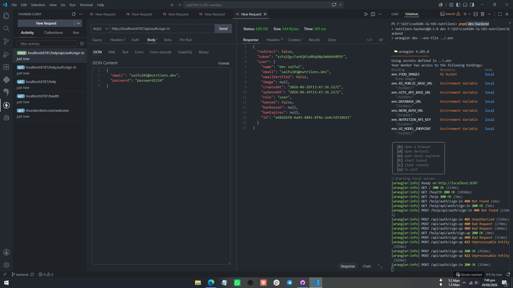
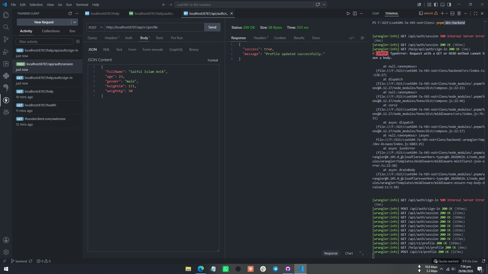
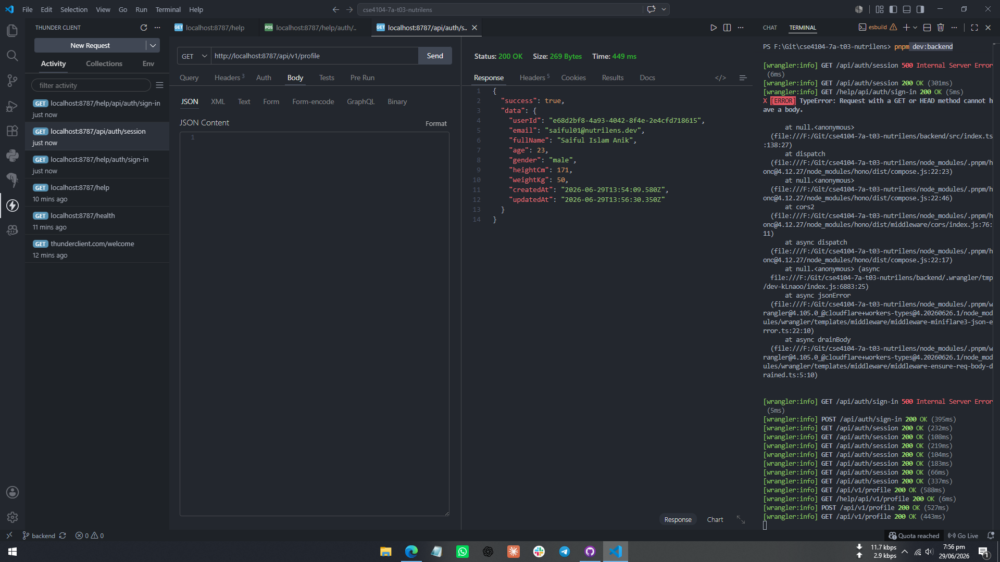
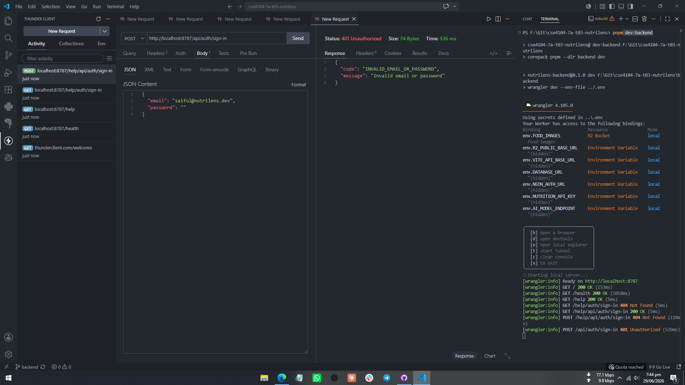
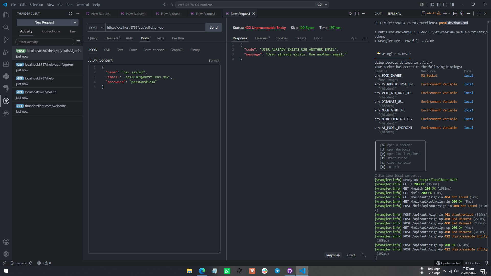
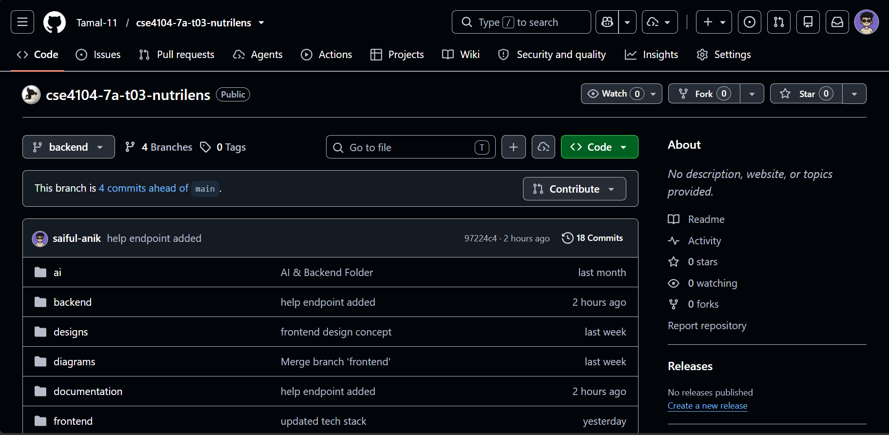

# CSE4104-7A-T03 Backend Progress Report

## Project Title

**NutriLens - AI Based Food Recognition and Nutrition Analysis System**

NutriLens is a food image based nutrition analysis system. Users can create an account, log in, upload a food image, receive a nutrition analysis result, and view previous analysis history.

## Team Information

| Field             | Information                                              |
| ----------------- | -------------------------------------------------------- |
| Course            | CSE4104                                                  |
| Section           | 7A                                                       |
| Team              | T03                                                      |
| Team Name         | CSE4104-7A-T03                                           |
| GitHub Repository | https://github.com/Tamal-11/cse4104-7a-t03-nutrilens.git |

| SL  | Name                   | Student ID  | Role              |
| --- | ---------------------- | ----------- | ----------------- |
| 1   | Md. Arafat Hossen      | 11230121099 | Team Leader       |
| 2   | Md. Saiful Islam Anik  | 11230121086 | Backend Developer |
| 3   | Md. Azizul Haque Rifat | 11230121087 | AI Engineer       |
| 4   | Gazi Nafisa Maliat     | 11250122046 | Frontend Designer |

## Backend Technology Stack

| Area             | Technology                     |
| ---------------- | ------------------------------ |
| Backend Runtime  | Node.js                        |
| API Framework    | Hono                           |
| Hosting Target   | Cloudflare Worker              |
| Database         | Neon PostgreSQL                |
| Authentication   | Neon Auth built on Better Auth |
| File Storage     | Cloudflare R2                  |
| Language         | TypeScript                     |
| Package Manager  | npm                           |
| API Testing Tool | Thunder Client                 |

## Backend Project Setup

The backend project is organized inside the `backend/` directory. The current structure is:

```text
backend/
  migrations/
    001_neon_app_schema.sql
    002_profile_triggers_and_seed.sql
  scripts/
    migrate.mjs
  src/
    api-docs.ts
    index.ts
  package.json
  tsconfig.json
  wrangler.toml
```

Important root-level folders:

```text
frontend/
backend/
documentation/
diagrams/
ai/
tests/
README.md
```

The backend can be started locally with:

```bash
npm run setup
npm --prefix backend run dev
```

Database migrations can be applied with:

```bash
npm run db:migrate
```

## Database Design Summary

The system uses Neon PostgreSQL for application data. Neon Auth manages authentication-related user and session tables separately. The application database stores user profiles, uploaded food image metadata, nutrition catalog data, analysis requests, and analysis results.

### Implemented Tables

| Table               | Purpose                                                        |
| ------------------- | -------------------------------------------------------------- |
| `user_profiles`     | Stores application profile information for authenticated users |
| `food_images`       | Stores uploaded food image metadata and R2 object references   |
| `nutrition_catalog` | Stores mock nutrition information used for analysis            |
| `analysis_requests` | Stores each food analysis request                              |
| `analysis_results`  | Stores the generated nutrition result for each request         |
| `schema_migrations` | Tracks applied SQL migration files                             |

### Primary Keys and Relationships

| Relationship                                                  | Description                                |
| ------------------------------------------------------------- | ------------------------------------------ |
| `user_profiles.user_id`                                       | Primary key for application profile        |
| `food_images.user_id -> user_profiles.user_id`                | One user can upload many food images       |
| `analysis_requests.user_id -> user_profiles.user_id`          | One user can create many analysis requests |
| `analysis_requests.image_id -> food_images.id`                | One uploaded image can be analyzed         |
| `analysis_results.request_id -> analysis_requests.id`         | One analysis request has one result        |
| `analysis_results.matched_catalog_id -> nutrition_catalog.id` | Result can reference a catalog food item   |

### Database Validation and Constraints

The schema includes:

- Primary keys using UUID values.
- Foreign keys for user, image, request, and catalog relationships.
- Unique constraints on `user_profiles.email`, `food_images.object_key`, `nutrition_catalog.food_name`, and `analysis_results.request_id`.
- Default timestamps using `now()`.
- Update triggers for `user_profiles.updated_at` and `nutrition_catalog.updated_at`.
- Indexes for efficient user-based image and analysis history queries.

## Authentication Workflow

Authentication is handled through Neon Auth. The Cloudflare Worker is the public backend boundary and proxies authentication requests to the private Neon Auth endpoint.

### Authentication APIs

| Method | Endpoint             | Purpose                               |
| ------ | -------------------- | ------------------------------------- |
| `POST` | `/api/auth/sign-up`  | Register a new user                   |
| `POST` | `/api/auth/sign-in`  | Log in an existing user               |
| `GET`  | `/api/auth/session`  | Get the current authenticated session |
| `POST` | `/api/auth/sign-out` | Log out the current user              |

### Workflow

1. User submits registration or login information from the frontend.
2. The backend receives the request at `/api/auth/*`.
3. The Worker forwards the request to Neon Auth.
4. Neon Auth verifies credentials and manages the session cookie.
5. Protected `/api/v1/*` routes validate the session before allowing access.
6. If the session is invalid or missing, the API returns `401 Authentication required`.

Password encryption and credential security are managed by Neon Auth / Better Auth. Application APIs do not store plain text passwords.

## Implemented APIs

### Utility APIs

| Method | Endpoint               | Authentication | Description                                 |
| ------ | ---------------------- | -------------- | ------------------------------------------- |
| `GET`  | `/`                    | No             | Returns API identity and base path          |
| `GET`  | `/health`              | No             | Checks backend and database availability    |
| `GET`  | `/help`                | No             | Lists documented API endpoints              |
| `GET`  | `/help/{endpointPath}` | No             | Shows documentation for a specific endpoint |

### User and Profile APIs

| Method | Endpoint          | Authentication | Description                                 |
| ------ | ----------------- | -------------- | ------------------------------------------- |
| `GET`  | `/api/v1/profile` | Required       | Retrieves the logged-in user's profile      |
| `POST` | `/api/v1/profile` | Required       | Creates or updates user profile information |

### Project-Specific NutriLens APIs

| Method | Endpoint                               | Authentication | Description                                                 |
| ------ | -------------------------------------- | -------------- | ----------------------------------------------------------- |
| `POST` | `/api/v1/upload-food-image`            | Required       | Uploads a food image to R2 and saves metadata in PostgreSQL |
| `POST` | `/api/v1/analyze-food`                 | Required       | Creates a mock nutrition analysis for an uploaded image     |
| `GET`  | `/api/v1/analysis-history`             | Required       | Lists previous analysis results for the logged-in user      |
| `GET`  | `/api/v1/analysis-history/:analysisId` | Required       | Retrieves a single analysis result                          |
| `GET`  | `/api/v1/nutrition-lookup`             | Required       | Returns mock nutrition information for a food item          |
| `GET`  | `/api/v1/health-insights`              | Required       | Returns mock health benefit and warning information         |

## Database Connectivity

The backend connects to Neon PostgreSQL using the `@neondatabase/serverless` package. API routes read from and write to the database after authentication is verified.

Implemented database operations include:

- Creating or updating user profile rows.
- Saving uploaded image metadata.
- Creating analysis request rows.
- Creating analysis result rows.
- Reading user-specific analysis history.
- Reading a single analysis result by ID.
- Reading mock nutrition catalog data.

The `/health` endpoint verifies database connectivity by running a test query.

## Error Handling

The backend includes error handling for common failure cases:

| Error Case                           | API Response                                   |
| ------------------------------------ | ---------------------------------------------- |
| Missing authentication session       | `401 Authentication required`                  |
| Missing image file during upload     | `400 Image file is required`                   |
| Missing `imageId` during analysis    | `400 imageId is required`                      |
| Image not found or not owned by user | `404 Food image was not found`                 |
| Profile not found                    | `404 Profile was not found`                    |
| Analysis not found                   | `404 Analysis was not found`                   |
| Database health check failure        | `503 degraded`                                 |
| Missing auth configuration           | `500 Authentication service is not configured` |

These responses prevent the backend from crashing when invalid or unauthorized requests are received.

## API Testing Summary

APIs were tested using an API testing tool such as Postman or Thunder Client. The testing workflow includes:

1. Register a new user.
2. Log in and receive a valid session.
3. Fetch the current session.
4. Create or update the user profile.
5. Upload a food image.
6. Analyze the uploaded food image.
7. Retrieve analysis history.
8. Retrieve a single analysis result.
9. Test invalid requests and authentication failures.
10. Log out the user.

### Tested API Checklist

| Status    | Endpoint                  |
| --------- | ------------------------- |
| Completed | `POST /api/auth/sign-up`  |
| Completed | `POST /api/auth/sign-in`  |
| Completed | `GET /api/auth/session`   |
| Completed | `POST /api/auth/sign-out` |
| Completed | `GET /api/v1/profile`     |
| Completed | `POST /api/v1/profile`    |

## Current Development Progress

| Requirement                    | Current Status                    |
| ------------------------------ | --------------------------------- |
| Backend project setup          | Completed                         |
| Organized backend structure    | Completed                         |
| Database schema implementation | Completed                         |
| Database migrations            | Completed                         |
| Authentication routes          | Completed through Neon Auth proxy |
| Session-based protected routes | Completed                         |
| Profile API                    | Completed                         |
| Food image upload API          | Completed                         |
| Mock nutrition analysis API    | Completed                         |
| Analysis history API           | Completed                         |
| Error handling                 | Completed for main API cases      |
| API documentation endpoint     | Completed                         |
| API testing                    | Completed with screenshots        |
| Real AI model integration      | Planned for next phase            |

## Screenshots

Replace each placeholder below with the actual screenshot before exporting the final PDF.

### 1. Backend Folder Structure



Caption: Backend folder structure showing `backend/`, `migrations/`, `src/`, and configuration files.

### 2. Database Tables



Caption: Neon PostgreSQL database tables including `user_profiles`, `food_images`, `nutrition_catalog`, `analysis_requests`, and `analysis_results`.

### 3. Authentication Registration Test



Caption: API testing screenshot for user registration.

### 4. Authentication Login Test



Caption: API testing screenshot for user login and session creation.

### 5. Profile API Test




Caption: API testing screenshot for fetching and updating user profile.

### 6. Error Response Test




Caption: API testing screenshot showing validation or authentication error response.

### 7. GitHub Repository



Caption: GitHub repository screenshot showing updated backend progress and commit activity.

## GitHub Repository Link

https://github.com/Tamal-11/cse4104-7a-t03-nutrilens.git

## Conclusion

The NutriLens backend has been set up with a scalable Worker-based architecture, PostgreSQL database schema, authentication workflow, protected APIs, food image upload support, mock nutrition analysis, history retrieval, and error handling. The backend is ready for continued development, including real AI model integration and expanded nutrition recommendation features.
