# NutriLens Development Roadmap

**Project:** NutriLens  
**Course:** CSE 4104 — Software Development III  
**Team:** CSE4104-7A-T03  
**Prepared from:** UI/UX Design and Development Planning document  

---

## 1. Roadmap Overview

NutriLens will be developed in a structured sequence from backend foundation to frontend implementation, AI model development, AI integration, nutrition analysis, testing, deployment, documentation, and final viva preparation.

The roadmap follows the original Week 6 to Week 14 development plan and expands it into milestone-based execution with graphs, dependencies, deliverables, and team ownership.

---

## 2. Roadmap Gantt Graph

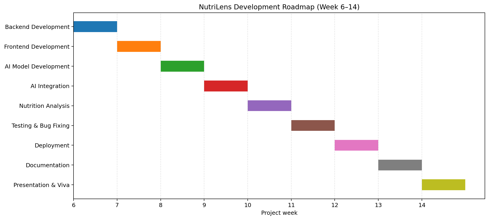

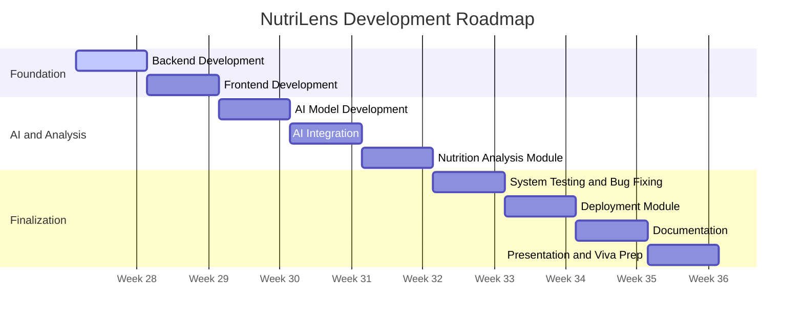

> Note: Calendar dates are roadmap placeholders. The official plan is organized by project weeks.

---

## 3. Week-by-Week Development Plan

| Week | Major Module | Development Activities | Team Responsibility | Expected Completion |
|---|---|---|---|---|
| Week 6 | Backend Development | Database setup, authentication, API development, profile management | Md Saiful Islam Anik, supported by Md Arafat Hossen | Backend foundation completed |
| Week 7 | Frontend Development | Homepage, login/register pages, dashboard, food image upload interface | Gazi Nafisa Maliat, supported by Md Arafat Hossen | Functional user interface completed |
| Week 8 | AI Model Development | Dataset preparation, model training, food image classification | Md Azizul Haque Rifat | AI model prototype completed |
| Week 9 | AI Integration | Connect AI model with backend APIs and frontend interface | AI Engineer and Backend Developer | End-to-end recognition completed |
| Week 10 | Nutrition Analysis Module | Calorie calculation, macro analysis, healthy/unhealthy classification, health risk generation | AI Engineer and Backend Developer | Nutrition analysis completed |
| Week 11 | System Testing and Bug Fixing | Functional testing, integration testing, performance testing, bug fixing | Entire team | Stable and tested system |
| Week 12 | Deployment Module | Deploy frontend/backend, configure database and hosting environment | Backend Developer and Team Leader | Live hosted application |
| Week 13 | Documentation | Final report, SRS update, API documentation, user manual | Entire team led by Team Leader | Documentation completed |
| Week 14 | Presentation and Viva Preparation | Slides, demo video, rehearsal, viva preparation | Entire team | Final presentation ready |

---

## 4. Development Sequence Graph

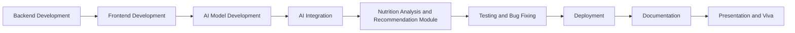

---

## 5. Dependency Graph

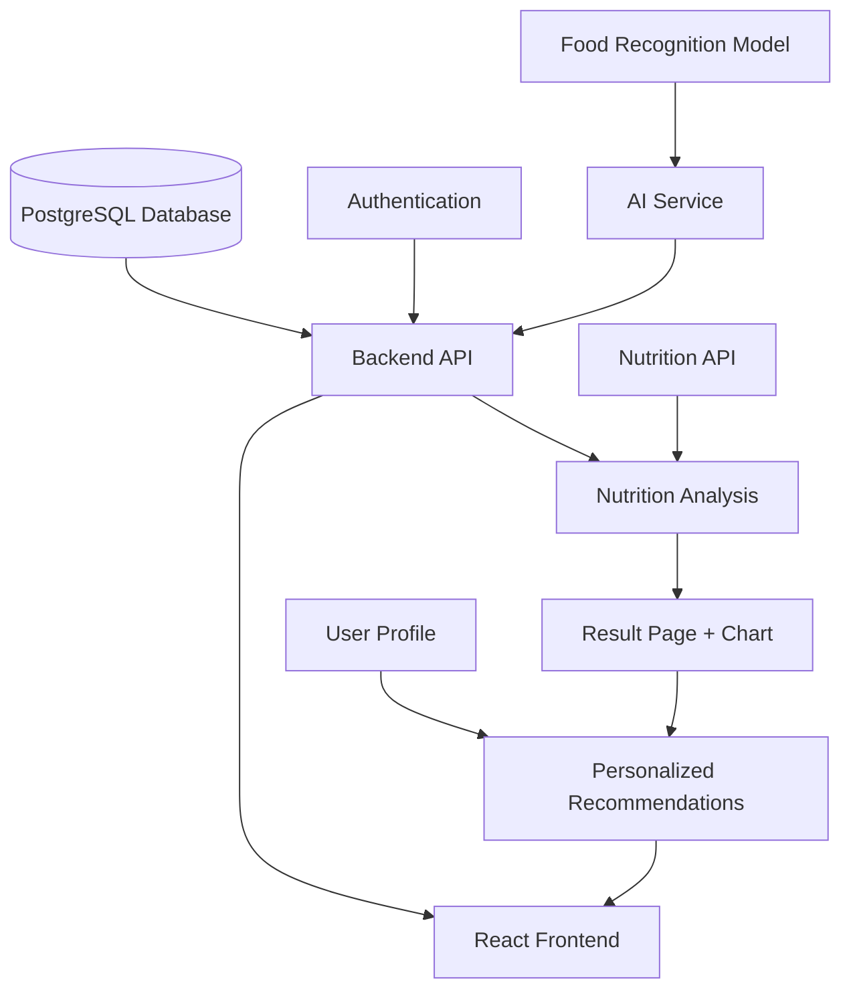

---

## 6. Milestone Graph

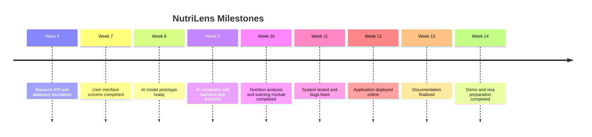

---

## 7. Major Modules and Deliverables

| Module | Core Features | Final Deliverable |
|---|---|---|
| User Management | Registration, login, authentication, profile management | Secure user account system |
| Food Recognition | Image upload, AI food detection, food classification | Food identification from image |
| Nutrition Analysis | Calories, protein, fat, carbohydrate analysis | Nutrition result screen with macro values |
| Health Assessment | Healthy/unhealthy status, risk warnings, dietary suggestions | Recommendation and warning system |
| System Integration | Frontend-backend communication, AI integration, database connectivity | End-to-end working application |
| Deployment and Documentation | Hosting, production setup, user manual, final report | Live project and final submission package |

---

## 8. Major Module Complexity Graph

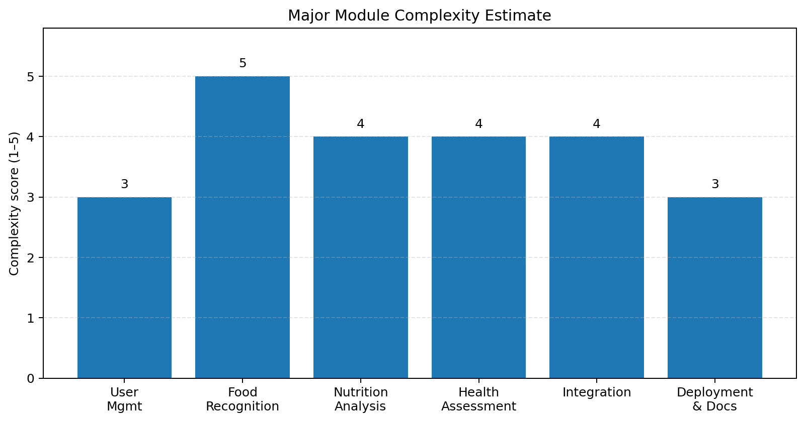

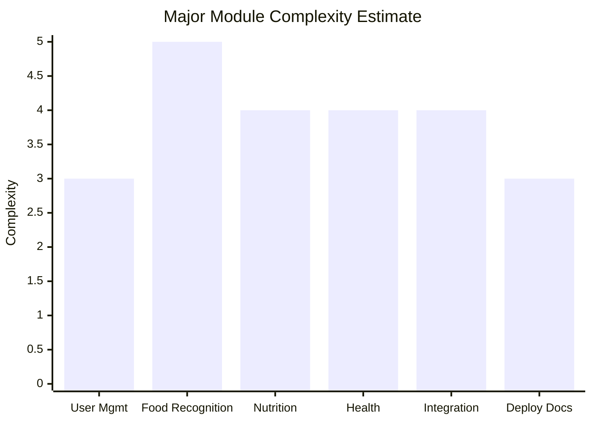

---

## 9. Team Responsibility Graph

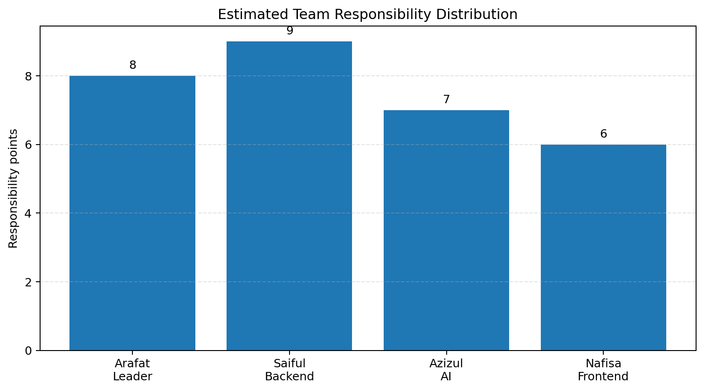

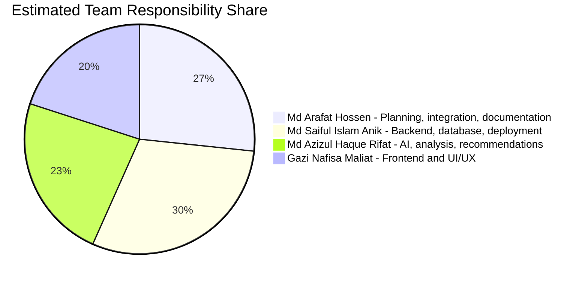

---

## 10. Team Task Distribution

| Team Member | Role | Main Responsibilities |
|---|---|---|
| Md Arafat Hossen | Team Leader / Project Manager / Full-stack Support | Planning, coordination, monitoring, GitHub management, integration support, documentation review, presentation preparation |
| Md Saiful Islam Anik | Backend Developer | REST API, authentication, profile management, server logic, API integration, deployment support |
| Md Azizul Haque Rifat | AI Engineer | Dataset preparation, model training, image recognition, nutrition logic, healthy/unhealthy classification, risk analysis |
| Gazi Nafisa Maliat | Frontend Developer and UI/UX Designer | UI/UX design, React frontend, responsive design, login/registration pages, dashboard, upload screen, result visualization |

---

## 11. Testing Roadmap

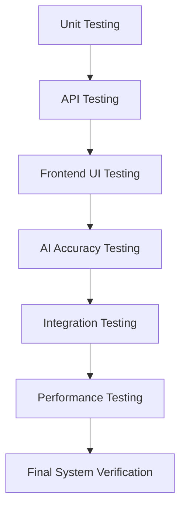

| Testing Area | Responsible Person | What Will Be Checked |
|---|---|---|
| System Integration Testing | Md Arafat Hossen | Complete workflow from login to result page |
| Backend and API Testing | Md Saiful Islam Anik | API responses, authentication, profile data, database connection |
| AI Model Accuracy Testing | Md Azizul Haque Rifat | Food recognition accuracy and nutrition logic |
| Frontend and UI Testing | Gazi Nafisa Maliat | Screen responsiveness, form validation, navigation, result visualization |

---

## 12. Release Plan

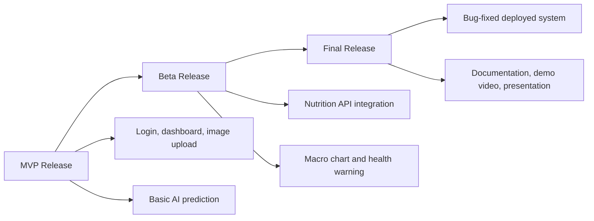

### MVP Release

The MVP should include registration, login, dashboard, food image upload, and basic food recognition result.

### Beta Release

The beta version should include nutrition API integration, calorie and macro display, healthy/unhealthy classification, and warning generation.

### Final Release

The final release should include all tested features, deployment, documentation, user manual, presentation slides, and demo video.

---

## 13. Risk Roadmap

| Risk | Impact | Mitigation Plan |
|---|---|---|
| AI model gives inaccurate food predictions | High | Use multiple model options, test on common food images, improve dataset quality |
| Nutrition API mismatch or missing food data | Medium | Add fallback manual mapping for common foods |
| Backend deployment issues | Medium | Deploy early in Week 12 and keep local fallback ready |
| Frontend responsiveness problems | Medium | Test on mobile and desktop during Week 7 and Week 11 |
| Integration delay | High | Keep API contract ready before Week 9 |
| Documentation delay | Medium | Start documentation updates from Week 10 instead of waiting until Week 13 |

---

## 14. Final Roadmap Checklist

- [ ] Backend API completed
- [ ] Database schema completed
- [ ] Authentication completed
- [ ] Frontend screens completed
- [ ] AI model prototype completed
- [ ] Food recognition integrated
- [ ] Nutrition API integrated
- [ ] Result page with macro chart completed
- [ ] Profile and personalized recommendation completed
- [ ] Full system testing completed
- [ ] Deployment completed
- [ ] Final documentation completed
- [ ] Presentation and viva demo ready
